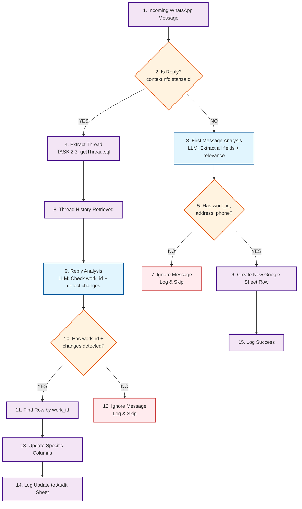

# WhatsApp Message Processing Flow Diagram

## Complete System Flow with Numbered Nodes



## Node Descriptions

| Node | Description | Action |
|------|-------------|---------|
| [1] | Incoming WhatsApp Message | Webhook receives message from EvolutionAPI |
| [2] | Is Reply? | Check if contextInfo.stanzaId present |
| [3] | First Message Analysis | LLM extracts all fields + relevance check |
| [4] | Extract Thread | Run getThread.sql to get complete thread history |
| [5] | Has work_id, address, phone? | Decision point: minimum required fields present? |
| [6] | Create New Google Sheet Row | Create new work order in Google Sheets |
| [7] | Ignore Message | Log and skip - no work order info |
| [8] | Thread History Retrieved | Complete thread history from database |
| [9] | Reply Analysis | LLM checks work_id + detects changes |
| [10] | Has work_id + changes detected? | Decision point: work order exists and changes found |
| [11] | Find Row by work_id | Locate existing sheet row using work_id |
| [12] | Ignore Message | Log and skip - no work order or changes |
| [13] | Update Specific Columns | Update only changed fields in sheet |
| [14] | Log Update to Audit Sheet | Record update details in audit log |
| [15] | Log Success | Log successful new order creation |

## Use Case Paths

### **Path A: First Message with Work Order**
```
[1] → [2] → [3] → [5] → [6] → [15]
```

### **Path B: First Message without Work Order**
```
[1] → [2] → [3] → [5] → [7]
```

### **Path C: Reply with Work Order + Changes**
```
[1] → [2] → [4] → [8] → [9] → [10] → [11] → [13] → [14]
```

### **Path D: Reply with Work Order + No Changes**
```
[1] → [2] → [4] → [8] → [9] → [10] → [12]
```

### **Path E: Reply without Work Order**
```
[1] → [2] → [4] → [8] → [9] → [10] → [12]
```

## Error Handling Paths

### **Error Path 1: Thread Extraction Fails**
```
[1] → [2] → [4] → [ERROR] → [12]
```

### **Error Path 2: First Message Analysis Fails**
```
[1] → [2] → [3] → [ERROR] → [7]
```

### **Error Path 3: Reply Analysis Fails**
```
[1] → [2] → [4] → [8] → [9] → [ERROR] → [12]
```

### **Error Path 4: Google Sheets Update Fails**
```
[1] → [2] → [4] → [8] → [9] → [10] → [11] → [13] → [ERROR] → [MANUAL_REVIEW]
```

## Performance Targets

- **Node [3]**: First Message Analysis < 2 seconds
- **Node [4]**: Thread Extraction < 2 seconds  
- **Node [9]**: Reply Analysis < 2 seconds
- **Node [11-14]**: Google Sheets Update < 2 seconds
- **Total End-to-End**: < 5 seconds

## Key Decision Points

| Decision Point | Node | Criteria |
|----------------|------|----------|
| Is Reply? | [2] | contextInfo.stanzaId present |
| Has Minimum Fields? | [5] | work_id, address, phone present (from LLM analysis) |
| Has work_id + Changes? | [10] | work_id found + changes detected (from LLM analysis) |

## Task Responsibilities

- **TASK 2.3**: Nodes [4], [8] - Thread extraction
- **TASK 2.4**: Nodes [3], [9] - Message analysis (simplified to 2 LLM calls)
- **TASK 2.5**: Nodes [11], [13], [14] - Google Sheets updates
- **TASK 2.6**: Nodes [1], [2], [5], [6], [7], [10], [12], [15] - Orchestration
